# Learning Logs Terminal — Tutorial

### Week 2 — Tutorial: JDBC + Database Storage

> *"Data that persists is knowledge that lasts."*

---

## Why This Week Matters

In Week 1, you stored topics and entries in an `ArrayList`. It worked — but every time you restarted the program, **all your data was gone**.

That's because `ArrayList` lives in memory (RAM). When the program stops, the memory is cleared.

This week, you'll store data in a **MySQL database** instead. The database saves data to disk, so it **persists forever** — even after you close the program, restart your computer, or unplug the power.

### What's New This Week

| Concept | What It Means | Why It Matters |
|---------|---------------|----------------|
| **JDBC** | Java Database Connectivity — a Java API for talking to databases | It's how Java apps connect to MySQL, PostgreSQL, Oracle, etc. |
| **DAO Pattern** | Data Access Object — separates database code from the rest of your app | Keeps your code organized and easy to change later |
| **SQL** | Structured Query Language — the language databases understand | `INSERT INTO`, `SELECT * FROM` — you'll write these inside Java |
| **PreparedStatement** | A safe way to run SQL queries with parameters | Prevents SQL injection attacks (a real security threat) |

### Week 1 vs Week 2

```mermaid
flowchart LR
    subgraph "Week 1 — In-Memory"
        A[Main] --> B[TopicService]
        B --> C["ArrayList<br/>(lost on restart)"]
    end
    subgraph "Week 2 — Database"
        D[Main] --> E[TopicDaoImpl]
        E --> F["MySQL Database<br/>(persists forever)"]
    end
```



| | Week 1 | Week 2 |
|--|--------|--------|
| Storage | `ArrayList` (in memory) | MySQL database (on disk) |
| Data lasts? | Only while program runs | Forever |
| Service class | `TopicService` | `TopicDaoImpl` (implements `TopicDao` interface) |
| Add a topic | `topics.add(topic)` | `INSERT INTO topics (name) VALUES (?)` |
| Get all topics | `return topics` | `SELECT * FROM topics` |
| New dependency | None | MySQL JDBC Driver (via Maven) |

---

## Java JDBC Architecture

**JDBC** (Java Database Connectivity) is the standard Java API for connecting to relational databases. It acts as a **bridge** between your Java application and any database (MySQL, PostgreSQL, Oracle, etc.).

### How JDBC Fits In


### Common JDBC Components

These are the 4 key classes you'll use in every database operation:

```mermaid
flowchart LR
    A["1️⃣ DriverManager"] -->|"getConnection(url, user, pass)"| B["2️⃣ Connection"]
    B -->|"prepareStatement(sql)"| C["3️⃣ PreparedStatement"]
    C -->|"executeQuery() or<br/>executeUpdate()"| D["4️⃣ ResultSet"]
```



| Component | What It Is | What It Does | You'll See It In |
|-----------|-----------|--------------|------------------|
| **`DriverManager`** | The "phone operator" | Finds the right JDBC driver and creates a connection to the database | `DatabaseConnection.java` |
| **`Connection`** | The "open phone line" | Represents an active link between your Java app and the database. Must be **closed** when done. | `TopicDaoImpl.java` |
| **`PreparedStatement`** | The "message you send" | A precompiled SQL query with `?` placeholders for safe parameter binding. Prevents SQL injection. | `TopicDaoImpl.java` |
| **`ResultSet`** | The "reply you receive" | The rows returned by a SELECT query. You loop through it with `rs.next()` to read each row. | `TopicDaoImpl.java` |

### JDBC Workflow — Step by Step


### How It Maps to Our Project

```
DriverManager.getConnection(url, user, pass)   ← DatabaseConnection.java handles this
         │
         ▼
    Connection conn                              ← You get this in TopicDaoImpl
         │
         ▼
    conn.prepareStatement(sql)                   ← You write the SQL query
         │
         ▼
    PreparedStatement stmt
    stmt.setString(1, topic.getName())           ← You fill in the ? placeholders
         │
         ▼
    stmt.executeUpdate()                         ← For INSERT (returns row count)
    stmt.executeQuery()                          ← For SELECT (returns ResultSet)
         │
         ▼
    ResultSet rs
    while (rs.next()) {                          ← Loop through returned rows
        rs.getInt("id")                          ← Read column values
        rs.getString("name")
        rs.getTimestamp("created_at")
    }
         │
         ▼
    DatabaseConnection.closeConnection(conn)     ← Always close when done!
```

> **Key takeaway:** You never talk to MySQL directly. Your code talks to JDBC, JDBC talks to the MySQL driver (`mysql-connector-j`), and the driver talks to the database. This is why you added `mysql-connector-j` to your `pom.xml` — it's the translator between JDBC and MySQL.

---

## Understanding the Concepts

### The Big Picture — A Library Analogy

Think of your entire application like a **library system**:

| Concept | Library Analogy | In Your Code |
|---------|----------------|--------------|
| **Database** | The library building with shelves of books | MySQL with the `topics` table |
| **JDBC** | The library's service desk — the official way to request books | `java.sql` package (Connection, PreparedStatement, etc.) |
| **JDBC Driver** | The librarian who knows where everything is stored | `mysql-connector-j` (translates your requests for MySQL specifically) |
| **Connection** | Your library card — you need it to borrow books, and you must return it when done | `DatabaseConnection.getConnection()` |
| **PreparedStatement** | A book request form — you fill in the blanks | `"INSERT INTO topics (name) VALUES (?)"` |
| **ResultSet** | The stack of books the librarian brings back | The rows returned by `SELECT * FROM topics` |
| **DAO** | The assistant who handles all library interactions for you | `TopicDaoImpl` — your code never talks to the database directly |

### What is a POJO / Entity?

You'll see two terms used for classes like `Topic.java`:

| Term | Full Name | Meaning |
|------|-----------|---------|
| **POJO** | Plain Old Java Object | Any simple Java class with private fields, a constructor, and getters/setters. No special frameworks needed. |
| **Entity** | Entity class | A POJO that specifically **maps to a database table**. Each field matches a column. Each object represents a row. |

Your `Topic.java` is **both** — it's a POJO (simple class) that's also an Entity (maps to the `topics` table). That's why it lives in the `entity/` package.

Think of it like a **shipping box** with a label. The box doesn't know where it came from (database) or where it's going (screen). It just holds the contents (id, name, timestamps).

**Each column in the table becomes a field in the class. Each row becomes an object.**

| Database Column (`topics` table) | Java Field (`Topic.java`) | Example Value |
|----------------------------------|--------------------------|---------------|
| `id` (INT) | `private int id` | `1` |
| `name` (VARCHAR) | `private String name` | `"Java Basics"` |
| `created_at` (TIMESTAMP) | `private Timestamp createdAt` | `2026-02-24 10:00:00` |
| `updated_at` (TIMESTAMP) | `private Timestamp updatedAt` | `2026-02-24 10:00:00` |

So when the database has this row:

| id | name | created_at | updated_at |
|----|------|------------|------------|
| 1 | Java Basics | 2026-02-24 10:00:00 | 2026-02-24 10:00:00 |

Your Java code reads it and creates this object:
```java
Topic topic = new Topic(1, "Java Basics", timestamp1, timestamp2);
// topic.getId()        → 1
// topic.getName()      → "Java Basics"
// topic.getCreatedAt() → 2026-02-24 10:00:00
```

**1 row in the table = 1 Topic object in Java.** If the table has 5 rows, you get 5 Topic objects (stored in an `ArrayList<Topic>`).

### What is the DAO Pattern?

**DAO = Data Access Object.** It separates *what* you can do from *how* it's done.

Think of it like **ordering food**:

| | Restaurant | Your Code |
|--|-----------|-----------|
| **The menu** (interface) | Lists what you can order: burger, pizza, salad | `TopicDao.java` — lists: `insertTopic()`, `fetchAllTopics()` |
| **The kitchen** (implementation) | Knows *how* to make each dish | `TopicDaoImpl.java` — knows *how* to run SQL queries |
| **You** (the caller) | You just pick from the menu — you don't need to know the recipe | `LearningLogs.java` — just calls `topicDao.insertTopic()` |

Why is this useful? If you later switch from MySQL to PostgreSQL, you only change the "kitchen" (`TopicDaoImpl`). The "menu" (`TopicDao`) and "you" (`LearningLogs`) stay the same.

### Why Use PreparedStatement? (SQL Injection)

Imagine a login form where users type their username. If you build SQL by gluing strings together:

```java
// DANGEROUS — never do this!
String sql = "SELECT * FROM users WHERE name = '" + userInput + "'";
```

A malicious user could type: `' OR '1'='1`

The query becomes:
```sql
SELECT * FROM users WHERE name = '' OR '1'='1'
```
This returns **every user** in the database — the attacker just bypassed your login!

**PreparedStatement prevents this** by treating user input as data, never as SQL code:

```java
// SAFE — always do this!
String sql = "SELECT * FROM users WHERE name = ?";
PreparedStatement stmt = conn.prepareStatement(sql);
stmt.setString(1, userInput);  // userInput is treated as a plain string, never as SQL
```

> Think of it like a **fill-in-the-blank form** vs writing a letter from scratch. The form has a fixed structure — no matter what you write in the blank, it can't change the form itself.

### Why Always Close Connections?

A database connection is like a **phone call** — the database can only handle a limited number of calls at once (typically ~150). If you open a connection and forget to close it:

```
Call 1: Open ✓  Close ✗  ← still holding the line
Call 2: Open ✓  Close ✗  ← still holding the line
Call 3: Open ✓  Close ✗  ← still holding the line
...
Call 150: Open ✓ Close ✗
Call 151: ☎ "All lines are busy!" → Connection refused!
```

That's why every database method follows this pattern:

```java
Connection conn = null;
try {
    conn = DatabaseConnection.getConnection();  // Pick up the phone
    // ... do your database work ...
} catch (SQLException e) {
    // Handle errors
} finally {
    DatabaseConnection.closeConnection(conn);   // Always hang up!
}
```

The `finally` block runs **no matter what** — even if an error occurs. This guarantees you always hang up the phone.

### What is Maven? (For beginners)

Maven is like a **shopping list manager** for your project.

Without Maven:
1. You need the MySQL driver? Google it. Find the right version. Download the `.jar`. Figure out where to put it. Add it to your classpath manually. Hope it works.
2. Your classmate has a different version? Their code breaks. Yours works. Chaos.

With Maven:
1. You write ONE line in `pom.xml`: "I need `mysql-connector-j` version `9.2.0`"
2. Maven downloads it automatically
3. Every student gets the exact same version — it just works

```xml
<!-- This one entry in pom.xml replaces all of that manual work -->
<dependency>
    <groupId>com.mysql</groupId>
    <artifactId>mysql-connector-j</artifactId>
    <version>9.2.0</version>
</dependency>
```

---

## Prerequisites — What You Need & Why

### Already Installed (from Week 1)

| Tool | Why You Need It |
|------|----------------|
| **JDK 25** | Compiles and runs your Java code |
| **IntelliJ IDEA** | Your code editor and debugger |

### New This Week

| Tool | Why You Need It | Install (Windows) | Install (Mac) |
|------|----------------|-------------------|---------------|
| **XAMPP** | Gives you a **MySQL database server** + **phpMyAdmin** (a web UI to manage your database). Without this, your Java app has nowhere to store data. | Download from [apachefriends.org](https://www.apachefriends.org/) | Download from [apachefriends.org](https://www.apachefriends.org/) |
| **Maven** | **Automatically downloads libraries** your project needs (like the MySQL JDBC driver). Without Maven, you'd have to manually find, download, and configure `.jar` files yourself. | Download from [maven.apache.org](https://maven.apache.org/download.cgi), extract, add `bin/` to system PATH | `brew install maven` |

### Verify Your Setup

Open a terminal and run:

```bash
java --version    # Should show: openjdk 25
mvn --version     # Should show: Apache Maven 3.x.x
```

If both commands work, you're ready!

---

## Database Setup

### Step 1: Start XAMPP

1. Open **XAMPP Control Panel**
2. Click **Start** next to **Apache**
3. Click **Start** next to **MySQL**
4. Both should show a green status

### Step 2: Import the Database

1. Open your browser and go to **http://localhost/phpmyadmin**
2. Click **Import** (top menu)
3. Click **Choose File** and select `sql/learninglog.sql` from this project
4. Click **Go** — this creates the `learning_logs` database with tables
5. Click **Import** again
6. Choose `sql/seed.sql` and click **Go** — this adds sample topics

### Step 3: Verify

In phpMyAdmin, you should see:
- Database: `learning_logs`
- Table: `topics` (with 5 sample rows: Python, Web Development, etc.)
- Table: `entries` (empty — used in the Workshop)

### Database Schema


> **Note:** The `entries` table exists in the database but we won't use it in this tutorial. You'll implement Entry database operations in the **Week 2 Workshop**.

---

## Quest Overview

Your mission: **complete all 9 TODOs** across 3 files to connect your app to a real database!

```
╔══════════════════════════════════════════╗
║     Welcome to Learning Logs Terminal    ║
║     Now with Database Storage!           ║
╚══════════════════════════════════════════╝

┌──────────────────────────────┐
│         MAIN MENU            │
├──────────────────────────────┤
│  1. Add a new Topic          │
│  2. View all Topics          │
│  3. Exit                     │
└──────────────────────────────┘
Choose an option (1-3):
```

---

## XP System

Earn **XP** by completing each TODO. Collect all **300 XP** to master this quest!

### Task 1: Topic Entity (110 XP)

| TODO | Task | XP | File |
|------|------|----|------|
| 1 | Declare Topic fields | 40 XP | `Topic.java` |
| 2 | Create Topic constructor | 20 XP | `Topic.java` |
| 3 | Create Topic getters & setters | 30 XP | `Topic.java` |
| 4 | Override Topic `toString()` | 20 XP | `Topic.java` |

### Task 2: Database Connection (70 XP)

| TODO | Task | XP | File |
|------|------|----|------|
| 5 | Declare connection constants (URL, user, password) | 30 XP | `DatabaseConnection.java` |
| 6 | Implement `getConnection()` | 20 XP | `DatabaseConnection.java` |
| 7 | Implement `closeConnection()` | 20 XP | `DatabaseConnection.java` |

### Task 3: Topic DAO Implementation (120 XP)

| TODO | Task | XP | File |
|------|------|----|------|
| 8 | Implement `insertTopic()` | 50 XP | `TopicDaoImpl.java` |
| 9 | Implement `fetchAllTopics()` | 70 XP | `TopicDaoImpl.java` |

| | **TOTAL** | **300 XP** | |

### Achievement Badges

| Badge | Name | How to Earn |
|-------|------|-------------|
| 🏛️ | **Architect** | Complete Topic entity (TODO 1–4) |
| 🔌 | **Connector** | Complete Database Connection (TODO 5–7) |
| ⚙️ | **Engineer** | Implement `insertTopic()` (TODO 8) |
| 🔧 | **Builder** | Implement `fetchAllTopics()` (TODO 9) |
| ⭐ | **Database Master** | All TODOs done + app runs end-to-end with database |

---

## Project Structure

```
src/main/java/com/learninglogs/
├── LearningLogs.java              ← PROVIDED (don't modify)
├── entity/
│   └── Topic.java                 ← YOUR WORK (TODO 1–4)
├── utils/
│   └── DatabaseConnection.java    ← YOUR WORK (TODO 5–7)
├── dao/
│   ├── TopicDao.java              ← PROVIDED (interface — study it)
│   └── TopicDaoImpl.java          ← YOUR WORK (TODO 8–9)
```

### What Each File Does

| File | Role | Provided? |
|------|------|-----------|
| `LearningLogs.java` | Main menu — takes user input, calls your DAO methods | Yes |
| `Topic.java` | **Entity / POJO** — represents a row in the `topics` table | TODO 1–4 |
| `DatabaseConnection.java` | **Utility** — manages database connections | TODO 5–7 |
| `TopicDao.java` | **Interface** — defines what operations are available | Yes |
| `TopicDaoImpl.java` | **Implementation** — contains the actual SQL queries | TODO 8–9 |

---

## Class Diagram


---

## Application Flow


---

## How It Works — Adding a Topic

```mermaid
sequenceDiagram
    participant U as User
    participant M as LearningLogs
    participant DAO as TopicDaoImpl
    participant DB as MySQL Database

    U->>M: Selects "1. Add Topic"
    M->>U: Asks for topic name
    U->>M: Enters "Java Basics"
    M->>DAO: insertTopic(topic)
    DAO->>DB: INSERT INTO topics (name) VALUES ('Java Basics')
    DB-->>DAO: success (1 row inserted)
    DAO-->>M: returns true
    M->>U: Shows "✓ Topic added: Java Basics"
```



---

## How It Works — Viewing Topics


---

## Getting Started

### Step 1: Install Prerequisites
Make sure you have JDK 25, Maven, and XAMPP installed (see Prerequisites section above).

### Step 2: Set Up the Database
Follow the Database Setup section to import `learninglog.sql` and `seed.sql`.

### Step 3: Open the Project
Open this project in **IntelliJ IDEA** (File → Open → select the project folder).

### Step 4: Understand the Code
Read these provided files first — they don't need changes:
1. **`LearningLogs.java`** — the main menu, shows what methods it calls
2. **`TopicDao.java`** — the interface, shows what methods you need to implement

### Step 5: Complete the TODOs
Work through the TODOs **in order** (1 → 9). Each TODO has:
- A description of what to do
- An explanation of **why** you're doing it
- A hint with example code

### Recommended Order:
1. **Topic.java** (TODO 1–4) → build the entity first
2. **DatabaseConnection.java** (TODO 5–7) → set up the database connection
3. **TopicDaoImpl.java** (TODO 8–9) → then write the SQL queries

### Step 6: Run the App
Make sure XAMPP MySQL is running, then:
```bash
mvn compile exec:java -Dexec.mainClass="com.learninglogs.LearningLogs"
```
Or run `LearningLogs.java` directly from IntelliJ.

---

## Expected Output

```
╔══════════════════════════════════════════╗
║     Welcome to Learning Logs Terminal    ║
║     Now with Database Storage!           ║
╚══════════════════════════════════════════╝

Choose an option (1-3): 2

── Your Topics ──────────────────
  [1] Python (Created: 2026-02-24 10:00:00.0)
  [2] Web Development (Created: 2026-02-24 10:00:00.0)
  [3] Data Science (Created: 2026-02-24 10:00:00.0)
  [4] Machine Learning (Created: 2026-02-24 10:00:00.0)
  [5] Cybersecurity (Created: 2026-02-24 10:00:00.0)
─────────────────────────────────
  Total: 5 topic(s)

Choose an option (1-3): 1
Enter topic name: Java Basics
✓ Topic added: Java Basics

Choose an option (1-3): 2

── Your Topics ──────────────────
  [1] Python (Created: 2026-02-24 10:00:00.0)
  [2] Web Development (Created: 2026-02-24 10:00:00.0)
  [3] Data Science (Created: 2026-02-24 10:00:00.0)
  [4] Machine Learning (Created: 2026-02-24 10:00:00.0)
  [5] Cybersecurity (Created: 2026-02-24 10:00:00.0)
  [6] Java Basics (Created: 2026-02-24 10:15:30.0)
─────────────────────────────────
  Total: 6 topic(s)

Choose an option (1-3): 3

Happy Learning! See you next time.
```

> Notice: The 5 seed topics are already in the database before you even add anything! That's the power of persistent storage.

---

## Test Cases

| # | Action | Input | Expected Result |
|---|--------|-------|-----------------|
| 1 | View topics (with seed data) | Select option `2` | 5 seed topics displayed |
| 2 | Add a topic | `Java Basics` | `✓ Topic added: Java Basics` |
| 3 | View topics after adding | Select option `2` | 6 topics (5 seed + 1 new) |
| 4 | Add topic with empty name | Press Enter | `⚠ Topic name cannot be empty!` |
| 5 | Restart the program | Run again | Topics still there (persistent!) |
| 6 | Invalid menu option | Enter `9` | `Invalid option. Please choose 1-3.` |
| 7 | Exit | Select option `3` | `Happy Learning! See you next time.` |

---

## XP Progress Tracker

Check off each task as you complete it:

### Task 1: Topic Entity
- [ ] **TODO 1** — Declare Topic fields (40 XP)
- [ ] **TODO 2** — Create Topic constructor (20 XP)
- [ ] **TODO 3** — Create Topic getters & setters (30 XP)
- [ ] **TODO 4** — Override Topic `toString()` (20 XP)
- [ ] Achievement Unlocked: **🏛️ Architect**

### Task 2: Database Connection
- [ ] **TODO 5** — Declare connection constants (30 XP)
- [ ] **TODO 6** — Implement `getConnection()` (20 XP)
- [ ] **TODO 7** — Implement `closeConnection()` (20 XP)
- [ ] Achievement Unlocked: **🔌 Connector**

### Task 3: Topic DAO
- [ ] **TODO 8** — Implement `insertTopic()` (50 XP)
- [ ] Achievement Unlocked: **⚙️ Engineer**
- [ ] **TODO 9** — Implement `fetchAllTopics()` (70 XP)
- [ ] Achievement Unlocked: **🔧 Builder**

### Final Test
- [ ] Start XAMPP MySQL
- [ ] Run the app
- [ ] View the 5 seed topics from the database
- [ ] Add a new topic and see it saved
- [ ] Restart the app — your topic is still there!
- [ ] Achievement Unlocked: **⭐ Database Master**

**Your Total: ___ / 300 XP**

---

## Hints & Tips

### JDBC Essentials
- `Connection conn = DatabaseConnection.getConnection()` — opens a database connection
- `PreparedStatement` — use `?` placeholders to prevent SQL injection
- `statement.setString(1, value)` — fills in the first `?` with a value
- `statement.executeUpdate()` — for INSERT, UPDATE, DELETE (changes data)
- `statement.executeQuery()` — for SELECT (reads data), returns a `ResultSet`

### Reading from ResultSet
- `rs.next()` — moves to the next row (returns false when no more rows)
- `rs.getInt("id")` — gets an integer column
- `rs.getString("name")` — gets a string column
- `rs.getTimestamp("created_at")` — gets a timestamp column

### Common Mistakes
- Forgot to start XAMPP MySQL? You'll get a `Connection refused` error
- Forgot to import the SQL files? You'll get `Unknown database 'learning_logs'`
- Forgot to close the connection? Your app may run out of connections over time
- Used `executeQuery()` for INSERT? Use `executeUpdate()` instead

### The DAO Pattern Explained
```
Interface (TopicDao)          →  "What can I do?"
  ├── insertTopic(topic)            Insert a topic
  └── fetchAllTopics()              Get all topics

Implementation (TopicDaoImpl)  →  "Here's how I do it"
  ├── insertTopic(topic)            Uses SQL INSERT
  └── fetchAllTopics()              Uses SQL SELECT
```

---

*Informatics College Pokhara — Java Programming By Sandesh Hamal*
